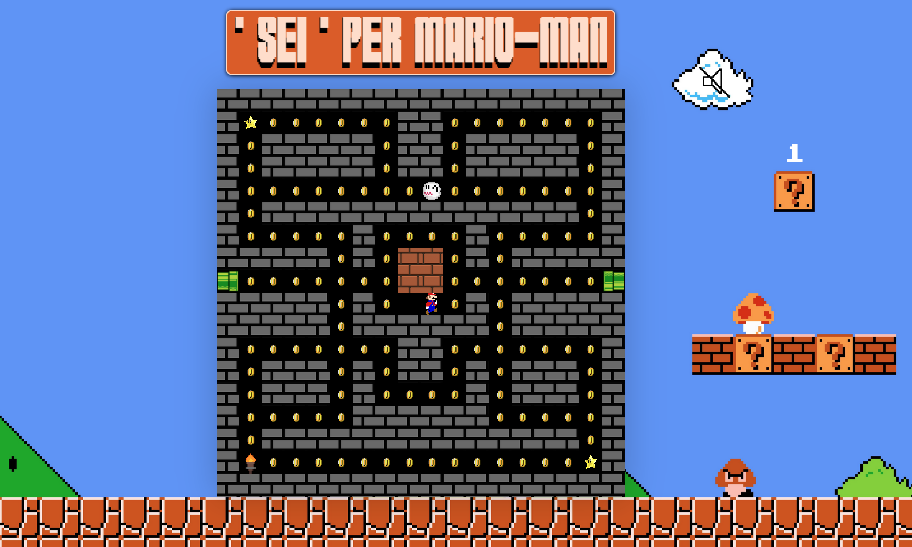
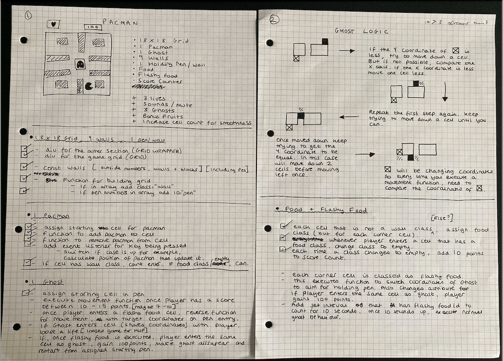
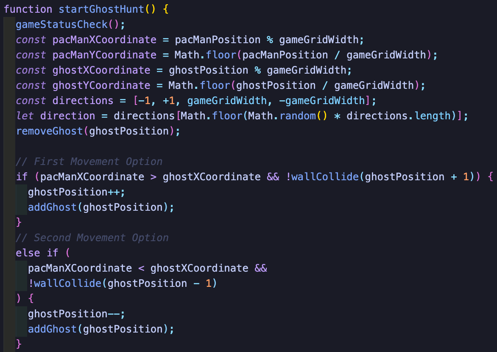
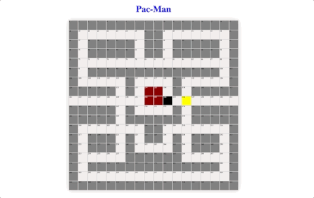
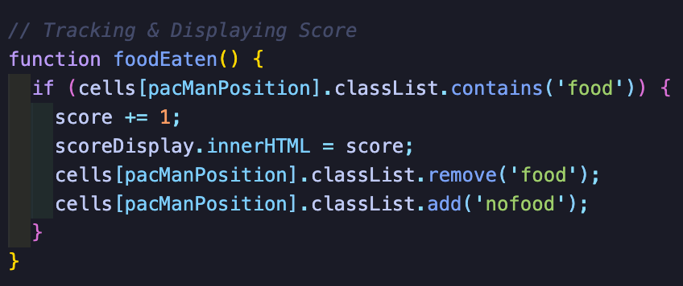
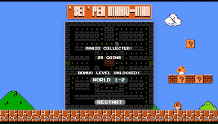

# SuperMario-Man - Project 1 @ GA (General Assembly)

This was my first solo project on the Software Engineering Immersive course.

## Deployment

This game has been deployed via GitHub Pages and is available [here](https://ashleygyngell.github.io/SEI-PER-MARIO-MAN/)

## Objective

To build a fully functioning game with pure JavaScript in 7 days. I was tasked with designing logic for winning conditions and displaying this to the user.

## Languages used

- JavaScript
- CSS3
- HTML5

## Concept

The player moves around the map to collect as many coins as possible without getting caught by the ghost. If the player collects the three special items, they instantly unlock the next level.

My game pays tribute to two of my favorite games growing up - Super Mario Bros & Pac Man.

## Phase One (Days 1-2)

**Concept, Whiteboarding & Pseudocoding.**
I broke the project down into components that included the data, presentation, user-interaction and DOM manipulation. I then ranked each subsection to highlight what functionalities were critical for a viable product which left the rest as stretch goals.

The hardest part of this phase was refining the logic for the movement of the ghost. I made use of the X & Y coordinates of the players position on the grid, instructing the ghost to match those coordinates.

## Phase Two (Days 3-5)

**Coding, Committing & Consulting**

I created multiple arrays with numbers that corresponded to their class name. These consisted of either walls, penWalls, portals and then the pacman and ghost cells. To create the grid, I set the width to be 18, used a for loop to create a div element, and appended this to a grid div in my HTML.

After adding event listeners to the arrow keys, I added collision detection for the walls which restricted the 'pacman' class being assigned to a div with a 'wall' class.

Finally, I created the basic ghost movement.

- Using a setInterval method, a function is called to compare the X Coordinate of the ghost to the X coordinate of the Pacman every 400 miliseconds.
- If this number is lower (the pacman is to the left of the ghost), and there is no wall in the way, then the ghost will move left, and will keep moving until the X coordinates are equal.
- However, if the X coordinate matches but the Y does not, the ghost will then try to match the Y axis.
- As a result, the ghost follows the user around the gameboard as shown below.

- Once I had the basic functionality working, I added a 'food' class to each empty div and added logic to track the users score.

- Towards the end of this phase I added the winning/loss condiditions, a scoretracker, and some viuals and the result was a viable product!

## Phase Three(Days 6-7)

Once I had the basic functionality working, I could start working on my stretch goals. This consisted of responsive design, audio, a second level and some audio easter eggs.

The second level is my proudest feature of this project but its execution utilises a very simple feature of DOM manipulation: the Z-index.

I created a second game grid that sits right behind the game grid for level one but is only brought forward when the user enters the second level. To achieve the 'torch-lit' effect - I simply manipulate the z index of the 8 divs surrounding the pacman and then on movement, revert the z index.

This inspired me to add a torch to my first level which the player must collect in order to progress to the next level.

To finish off the project, I added some sound effects, a mute button and hid two easter eggs (one on the coin box and one on the goomba) that play a sound effect once clicked.

## Wins

Sound effects - These really brought the game to life and create an immersive experience for the user.
Ghost Logic - The essence of being hunted is there which is exacctly what i wanted to achieve.

## Challenges.

Resetting the coins for level two. I was very close to achieving this in the three days i spent fixing code. However to support usability, i added in a page refresh whenever the user wants to restart the game.

The logic of the ghost movement. During phase Three, i created another iteration of the ghost movement which moves more intellegently, whilst using my initial logic as inspiration. However, in this code if the ghost gets stuck and cant move, it keeps moving until it hits a wall and then restarts the ghosthunt.

## Further Stretch Goals.

Had I had more time for this project, I would have added functionality for the ghost return to its pen once the user had collected a star. This wouldnt be too hard to achieve as it would just be a reverse of the ghosthunt function.
Multiple ghosts.

## Takeaways.

This was an extremley rewarding exercise and a fun way to consolidate my JS skills. In particular, learnt a lot about DOM manipulation, array methods and deployment. In summary, The challenge was 10/10, would reccomend.
